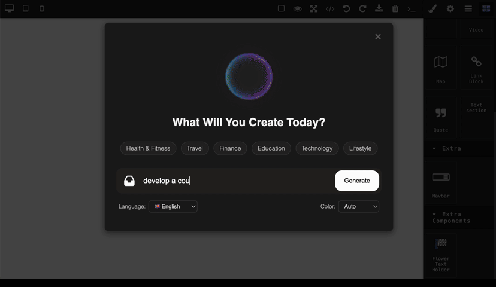

# 🌐 AI Powered Web Page Builder with GrapesJS

An AI-powered web editor built on top of **GrapesJS**, developed in **Python**.  
This project provides an interactive interface for visually coding web pages with drag & drop functionality, enhanced by an AI agent to assist in content generation and editing.

---

changing the 

<p style="color:red;"><strong>Note:</strong> This project is a part of the "AI Integration in GrapesJs Website Builder" assessment containing only MVP for Fleapo.</p>

## 🚀 Features

- 🤖 AI Agent (Website Generation / Website Modification)
- 🖼️ Visual Web Page Editing (Drag & Drop)
- 🐍 Python-based lightweight realtime backend
- 🎨 Built using GrapesJS
- 🌍 Simple & Clean UI

---

## 🎥 Feature Demos

### 1. 🚀 Website Generation



---

### 2. 🌐 Multi-language Support


---

### 3. ✏️ Website Modification


---


## ⚙️ Installation & Setup Options

### 1. Clone the Repository

```bash
git clone https://github.com/utpalendubarman/aigrapesjs.git
cd aigrapesjs
pip install -r requirements.txt
mv .env.example .env # Add OpenAI API Key
python app.py
```
#### * Must consider to cinfigure web socket if hosting in a cloud server


